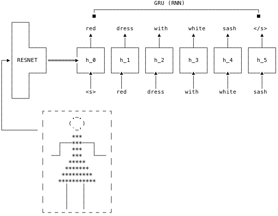

This deliverable details the results of task T2.4, in which we have compiled and trained
a library of models for enriching images with meta-data using recent advances in
state-of-the-art deep learning techniques.

## Deep Learning

Deep-learning is a subset of machine learning techniques ([Bishop 2006](#references)) which aims to perform simultaneous feature extraction and model training from labelled or unlabelled examples. Typically models are either feedforward or recurrent neural networks consisting of multiple layers of alternating linear-transformation followed by non-linear activation functions, hence the term "deep" ([Goodfellow et al. 2016](#references)).

The roots of deep-learning can be traced back to the early days of computer science, with the first multi-layer neural networks going back to at least as early as [Ivakhnenko & Lapa (1967)](#references). However it has not been until recent years that advances in data collection, parallel architectures and computational power have enabled large scale deep-learning, performing tasks such as image recognition ([Krizhevsky et al. 2012](#references)), language modeling ([Sutskever et al. 2011](#references)) and machine translation ([Sutskever et el. 2014](#references)) close to human-level performance.

More formally, given input and output data $$(x_i, y_i)$$, where the "input", $$x_i$$ is parametrized as a vector in a high dimensional vector space $$x_i \in \mathbb{R}^d$$, *supervised* deep learning is concerned with learning a function between this tuple:

$$f: x \longmapsto y$$

Such that $$\forall i \in 1, \dots, n$$:

$$f(x_i) \approx y_i$$

It is possible to prove that a simple "two-layered" perceptron is sufficient to express the multitude of all such functions, given conditions on differentiability and compactness of the domain of the function ([Cybenko 1989](#references)):

$$f(x) := W_o \sum_{j=1}^m \text{tanh}(W_x x + b_b) + b_o$$

However in principle, any number of "layers" may be applied to approach the task of finding a map between the two spaces:

$$f: = g_n \circ g_{n-1} \circ \dots g_1 \circ g_0$$

## Computer Vision

A text-book application of deep-learning, and indeed machine learning, is computer vision ([Goodfellow et al. 2016](#references)). Computer vision is the research field which pursues the goal (among others) of replicating the functionality of the human visual system using computer modelling and programs. In the early days of computer vision, methods were often based on painstakingly hand-crafted feature engineering using heuristics and extensive trial and error ([Lowe 1999](#references)). [Krizhevsky et al. (2012)](#references) showed that these features may be learnt more easily, achieving vastly superior performance, in a data driven way using neural networks with several important innovations over traditional neural networks:

- Many data points $$(x_i, y_i)$$ should be seen in training. This number of data points may only be handled by a "stochastic gradient descent algorithm" and parallel computation on a graphical processing unit (GPU), with data-parallelism over "mini-batches" of data points.
- Many more layers of alternating linear functions and non-linearities should be learnt than the traditional two or three layers.
- Explosion in the number of parameters should be restricted through the extensive use of "convolutional" layers in the initial stages of the neural network, i.e. tiled layerwise spatial filtering with learnt filter coefficients and expansion of the RGB channel space.
- Gradients should be forced to be well behaved through these layers using a "rectified linear-unit" non-linearity: $$\sigma(x) = \text{max}(0, x)$$
- Available data should be augmented using random affine transformations to avoid overfitting on the available training data.

## Natural Language Processing

In analogy to computer vision, natural language processing (NLP) is the research field which pursues the goal (among others) of replicating human linguistic ability using computer modelling and programs. As for computer vision,  in the early days of NLP, methods were often based on painstakingly hand-crafted feature engineering using heuristics and extensive trial and error ([Liddy (2001)). Work on deep learning showed that these features may be learnt more easily, achieving superior performance, in a data driven way using recurrent neural networks (RNNs). Critical here are the following features in learning:

- Some technique must be used to combat vanishing/ exploding gradients encountered in e.g. traditional Elman RNNs. The prototypical method to achieve this is using a gated recurrent architecture, such as the LSTM ([Hochreiter & Schidhüber 2001](#references)).
- The use of attentional mechanisms is known to improve performance and learning ([Graves et al. 2014)](#references).
- As in computer vision, mini-batch learning with stochastic gradient descent must be used to combat the large dataset sizes.
- Parallelism across mutliple GPUs is necessary to tackle the large size of linguistic datasets.
- Various dropout techniques (ensembling methods applied to neural networks) may be applied in the case of smaller dataset sizes.

## Deep Learning in Fashion

Fashion is in many senses the prototypical and paradigmatic application of deep learning and computer vision in industry. The essence of fashion products is typically only captured by high resolution photos (or indeed videos), with companies such as Zalando SE (FB partner) displaying as many as seven high quality images of products as well as short video snippets of models demonstrating the products. The desideratum  for deep-learning powered computer vision, that data be plentifully available, is additional exemplified in e-commerce companies such as Zalando SE, insofar as typically of the order of $$\sim 10^6$$ products are available in product catalogues as any given time. 

The business case for deep-learning in fashion stems from the need to process and categorize this vast amount of product data and glean algorithms to further recommend products to suitable customers, intelligently index product data for search and perform high level tasks typically performed at great cost by domain experts, such as outfit construction.

## Tasks Addressed

In this deliverable we provide a schematic codebase and illustrative applications of deep-learning applied to fashion images. The final months of the work package will be used applying this schematic to the data obtained in T2.1 and T2.2. Using data from the historical Zalando catalogue already provided in the Fashion Project, we have trained a deep neural networks to perform:

1. Colour classification
2. Brand classification
3. Clothing type classification

4. Image annotation

## Overview of the Architectures

Our computer vision architecture is a classical 50 layered residual network ("resnet50") ([He et al. 2015](#references)). Residual networks have become the accepted architecture for performing image classification in computer vision due to their smooth gradients, accurate performance and modularity. See the image below for a schematic of a 34-layered residual network ("resnet34").


For image annotation we use a gated recurrent unit (GRU) architecture, with initial hidden state initialized by the output of a *resnet50*:



## Model Training and Codebase

Code is available here for download: https://github.com/zalandoresearch/fb-model-library  

### Classification

A typical call to train a model image library takes the form:

```bash
python classify.py \ 
  --mode train \
  --model_type <brand/color/pool> \
  --checkpoint <save-path> \
  --lr <learning-rate> \
  --n_epochs <number-of-epochs> \
  > <save-path>/log
```

Visualization of training-progress as displayed in the log file may be invoked by:

```bash
python classify.py \ 
  --mode plot \
  --checkpoint <save-path>
```

The trained model may be tested by:

```bash
python classify.py \ 
  --mode test \
  --checkpoint <save-path>
```

At the highest level, the classification model, which is written in the Pytorch framework, is summarised as follows:

```python
class Classify(torch.nn.Module):
    def __init__(self, n_classes, finetune=False):
        torch.nn.Module.__init__(self)

        self.cnn = resnet()
        self.linear = torch.nn.Linear(2048, n_classes)
        self.finetune = finetune

    def forward(self, x):
        if self.finetune:
            return self.linear(self.cnn.features(x))
        else:
            return self.linear(self.cnn.features(x).detach())
```

Hence the nuts and bolts of the convolutional neural network are contained in the function ```resnet```.

### Image Annotation

Training proceeds by:

```bash
python annotate.py \ 
  --mode train \
  --catalog <dataset> \
  --checkpoint <save-path> \
  --lr <learning-rate> \
  --n_epochs <number-of-epochs> \
  > <save-path>/log
```

The core model in this task is:

```python
class Annotator(torch.nn.Module):
    def __init__(self, n_vocab):
        torch.nn.Module.__init__(self)

        self.rnn = torch.nn.GRU(64, 512, 1, batch_first=False)
        self.embed = torch.nn.Embedding(n_vocab, 64)
        self.project = torch.nn.Linear(512, n_vocab)
        self.init = torch.nn.Linear(2048, 512)

    def forward(self, x, y, hidden=None):
        if hidden is None:
            hidden = self.init(x)
            hidden = hidden[None, :, :]

        hidden, _ = self.rnn(self.embed(y), hidden)
        return self.project(hidden), hidden

    def annotate(self, x, start, finish):
        last = torch.LongTensor([start])
        y = [start]
        while True:
            if len(y) == 1:
                out, hidden = self(x[None, :], last[None, :])
            else:
                out, hidden = self(x[None, :], last[None, :], hidden)
            last = out.squeeze().topk(1)[1]
            y.append(last.item())
            if y[-1] == finish:
                break

        return y
```

## References

Bishop, C. M. (2006). Machine learning and pattern recognition. Information Science and Statistics. Springer, Heidelberg. [[url](https://www.springer.com/de/book/9780387310732?referer=www.springer.de)]

Goodfellow, I., Bengio, Y., Courville, A., & Bengio, Y. (2016). Deep learning (Vol. 1). Cambridge: MIT press. [[url](http://www.deeplearningbook.org/)]

Lowe, D. G. (1999). Object recognition from local scale-invariant features. In *Computer vision, 1999. The proceedings of the seventh IEEE international conference on* (Vol. 2, pp. 1150-1157)

Ivakhnenko, A. G., & Lapa, V. G. (1967). Cybernetics and forecasting techniques. [[url](https://books.google.de/books/about/Cybernetics_and_forecasting_techniques.html?id=rGFgAAAAMAAJ&redir_esc=y)]

Krizhevsky, A., Sutskever, I., & Hinton, G. E. (2012). Imagenet classification with deep convolutional neural networks. In *Advances in neural information processing systems* (pp. 1097-1105). [[url](http://papers.nips.cc/paper/4824-imagenet-classification-with-deep-convolutional-neural-networks.pdf)]

Sutskever, I., Martens, J., & Hinton, G. E. (2011). Generating text with recurrent neural networks. In *Proceedings of the 28th International Conference on Machine Learning (ICML-11)* (pp. 1017-1024). [[url](https://www.cs.utoronto.ca/~ilya/pubs/2011/LANG-RNN.pdf)]

Sutskever, I., Vinyals, O., & Le, Q. V. (2014). Sequence to sequence learning with neural networks. In *Advances in neural information processing systems* (pp. 3104-3112). [[url](http://papers.nips.cc/paper/5346-sequence-to-sequence-learning-with-neural-networks.pdf)]

Cybenko, G. (1989). Approximation by superpositions of a sigmoidal function. *Mathematics of control, signals and systems*, *2*(4), 303-314. [[url](https://pdfs.semanticscholar.org/05ce/b32839c26c8d2cb38d5529cf7720a68c3fab.pdf)]

He, K., Zhang, X., Ren, S., & Sun, J. (2016). Deep residual learning for image recognition. In *Proceedings of the IEEE conference on computer vision and pattern recognition* (pp. 770-778). [[url](http://openaccess.thecvf.com/content_cvpr_2016/papers/He_Deep_Residual_Learning_CVPR_2016_paper.pdf)]

Liddy, E. D. (2001). Natural language processing.

Graves, A., Wayne, G., & Danihelka, I. (2014). Neural turing machines. *arXiv preprint arXiv:1410.5401*.

